# Introduction 

The HueCube is a small colorful, programmable cube measuring 46x46x46mm.
You can play around with the example code using the [Arduino IDE](https://www.arduino.cc/), and change it's behavior.
By reading data from the embedded sensors, you can let the colors change by temperature, height, angle, tapping, tilting, dropping or humidity. See the following videos for a few examples:

<a href="https://www.instagram.com/p/BlyA0LyDXAq/?taken-by=pauls_3d_things">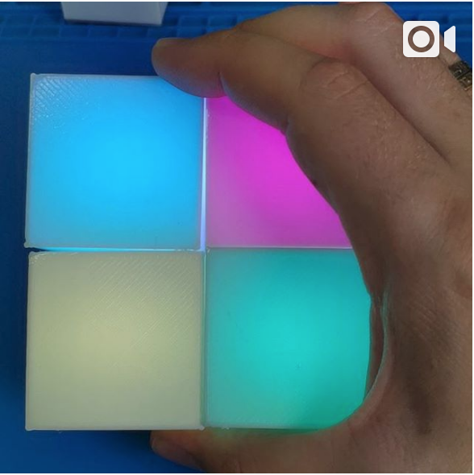</a>
<a href="https://www.instagram.com/p/BlvR7RuHtR8/?taken-by=pauls_3d_things">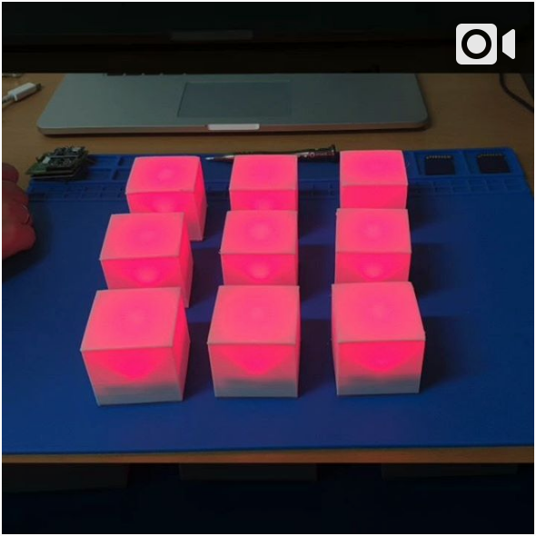</a>
<a href="https://www.instagram.com/p/BlyO7W0BeAI/?taken-by=pauls_3d_things">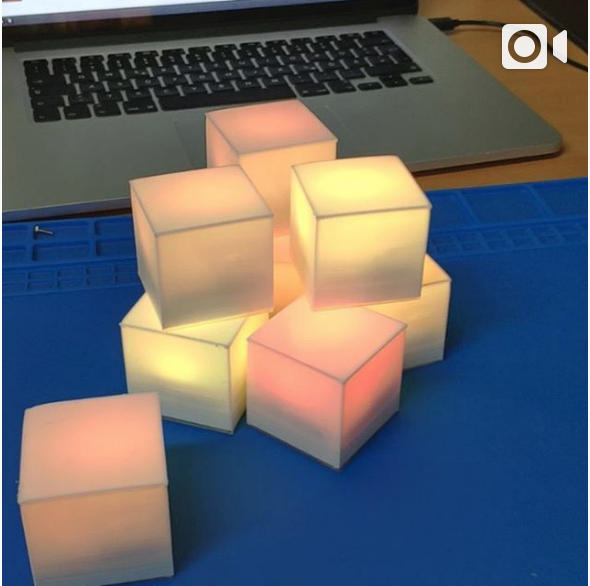</a>
<a href="https://www.instagram.com/p/BlyQyMNj2a8/?taken-by=pauls_3d_things">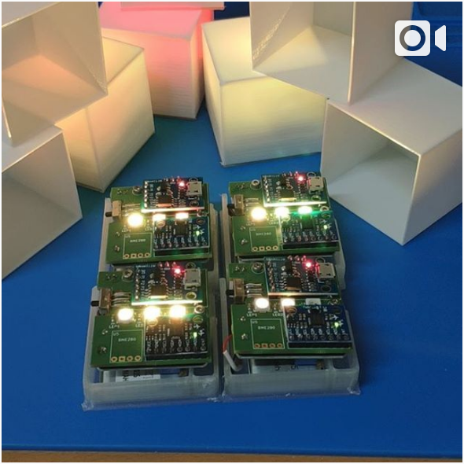</a>

## What do you need?

### Soldering
To assemble the board you need to be able to solder SMD components (0603) and a few pins. I am using [this](https://www.aliexpress.com/item/Hot-Sale-220V-110V-60W-Adjustable-Temperature-Electric-Soldering-Iron-Welding-Solder-Station-Heat-Pencil-With/32434361333.html) and [this](https://www.aliexpress.com/item/Free-Shipping-0-3mm-0-4mm-0-5-mm0-6mm-Tin-Lead-Rosin-Core-Solder-Wire/32335236726.html).

### Software
- [Blender3D](https://www.blender.org/), to design the 3d printed case:
    * USB Powered:  <a href="Screenshots/cube-usb.png">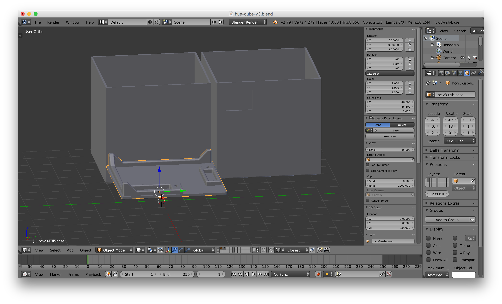</a>
    * LiPo Powered: <a href="Screenshots/cube-lipo.png">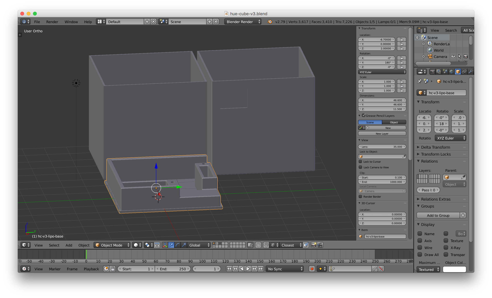</a>
- [KiCad](http://kicad-pcb.org/), to design the PCB
    * Schematics:  <a href="Screenshots/schematics.png">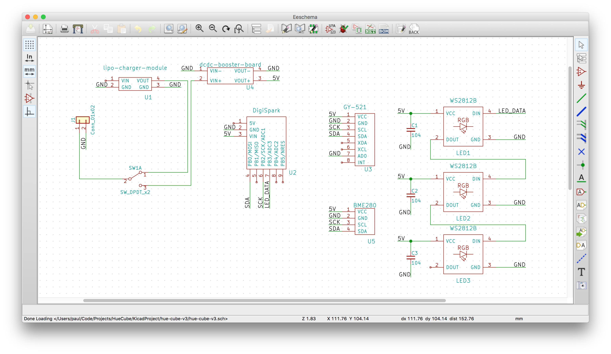</a>
    * Circuit Board:  <a href="Screenshots/pcb.png">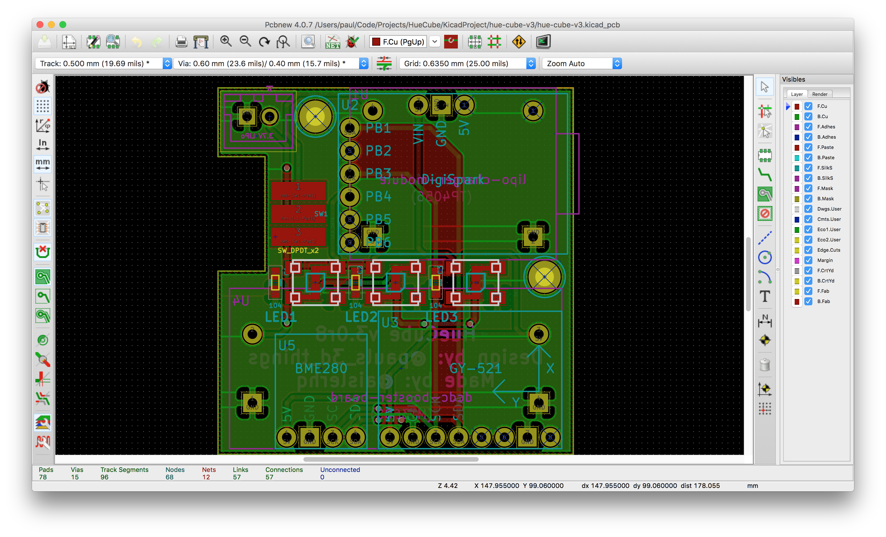</a>
- [Arduino IDE](https://www.arduino.cc/), to write the code and flash the device
   *  <a href="Screenshots/arduino.png">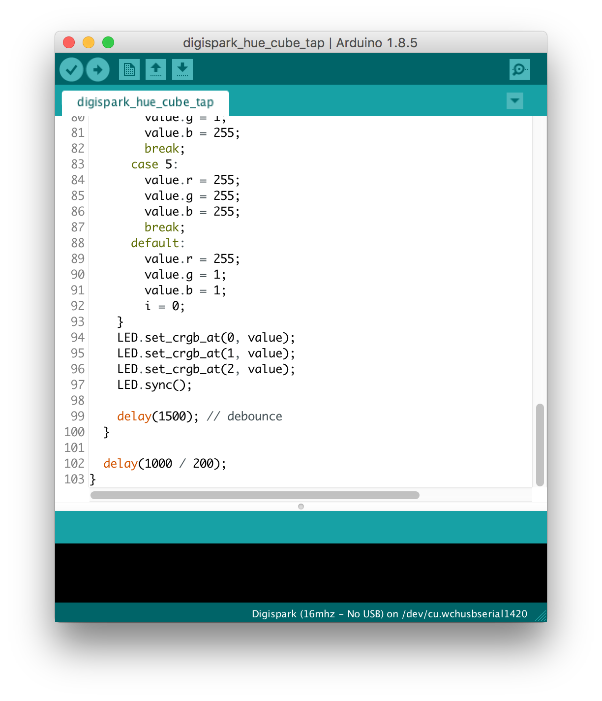</a>
   * The [light_ws2812](https://github.com/cpldcpu/light_ws2812) library to control the LEDs. Download the .zip from the `/light_ws2812_Arduino/` folder and place it into `Arduino/libraries/`. I chose this library, due to the small flash size of the attiny85.

### Hardware
The HueCube is made of small, electronic modules that are soldered onto a PCB. You can order the PCB directly from [AISLER](https://aisler.net/p/VAADXKWB), or use the [KiCad](http://kicad-pcb.org/) project files form this repository to modify it.
Currently, there are two design variant.

- USB Powered
    * 3D printed parts: 1x `BlenderModel/hc-v3-usb-base.stl` and  1x `BlenderModel/hc-v3-usb-cube.stl`
    * [1x ATTiny / DigiSpark](https://www.aliexpress.com/item/Attiny85-Digispark-Kickstarter-Development-Board-Module-For-Arduino-Built-in-USB-500ma-5V-Regulator-8k-Flash/32279051124.html)
    * [1x MPU-6050](https://www.aliexpress.com/item/MPU-6050-3-Axis-gyroscope-acce-lerometer-module-3V-5V-compatible-For-Arduino/2035920870.html)
    * [1x ON/OFF Switch](https://www.aliexpress.com/item/Promotion-50-Pcs-SS12D00G3-2-Position-SPDT-1P2T-3-Pin-PCB-Panel-Mini-Vertical-Slide-Switch/32649542037.html) (I know, not the ideal switch, but I had those lying around, so I will be using them)
    * [3x WS2812B](https://www.aliexpress.com/item/100PCS-New-Version-WS2812B-5050-RGB-SMD-WS2811-IC-WS2812-For-Strip-Screen-etc/32776703442.html) you can use them for all sorts of projects ;)
    * [3x 0603 100nF Capacitor](https://www.aliexpress.com/item/MCIGICM-100pcs-0603-smd-capacitor-ceramic-22pf-100nf-1uf-2-2uf-4-7uf-10uf-capacitors-kit/32841971485.html) (or you could search for a kit with multiple values)
- LiPo Powered
    * 3D printer files: 1x `BlenderModel/hc-v3-lipo-base.stl` and 1x `BlenderModel/hc-v3-lipo-cube.stl`
    * [1x TP4056 LiPo Charger](https://www.aliexpress.com/item/5Pcs-Lot-TP4056-Micro-USB-5V-1A-18650-Lithium-Battery-Charger-Board-With-Led-Indicator-Over/32675099957.html) **⚠️make sure to replace the PROG resistor⚠️**. The resistor value depends on your LiPo size. When using a 400mA battery, use [1x 10k Ohm 0603](https://www.aliexpress.com/item/300pcs-0603-SMD-Resistor-1-6-8K-7-5K-8-2K-9-1K-10K-ohm/32308220603.html?spm=a2g0s.9042311.0.0.27424c4dsotU5N), this will give you around ~100mA charging current. (or you could search for a kit with multiple values)
    * [1x MT3608 DC-DC Step Up Converter](https://www.aliexpress.com/item/5pcs-MT3608-DC-DC-Step-Up-Power-Apply-Module-Booster-Power-Module-MAX-output-28V-2A/32517710689.html) **⚠️set this to 5V output before soldering⚠️**

## How to Build?

### Soldering

#### Manually soldering the LEDs
First, solder the WS2812B to the PCB, note the corner with the triangle is GND, so this needs to be aligned to the bottom right pad. See the video for detais:

*Video:*

<a href="https://www.instagram.com/p/BkfG1lynbuw/?taken-by=pauls_3d_things">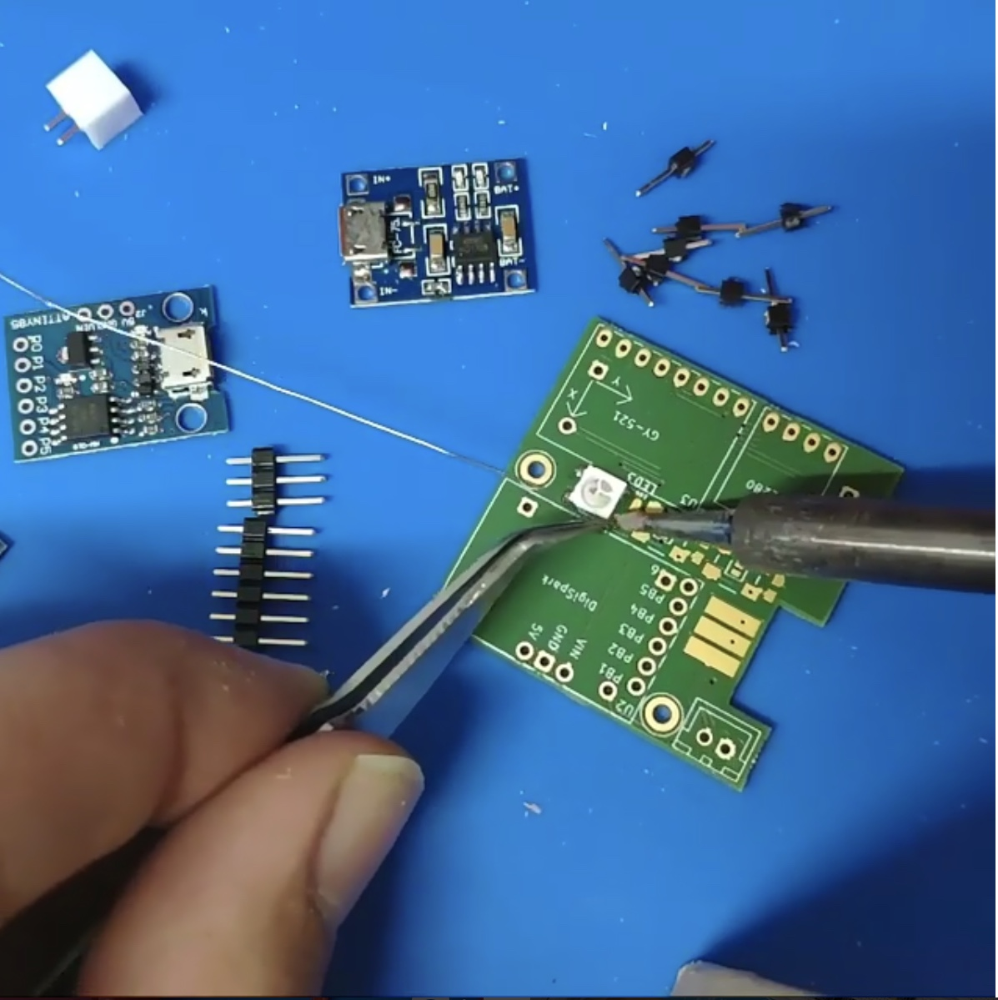</a>

#### SMD soldering the LEDs
If you have a hot airstation and liquid solder, it is a lot easier to solder the SMD components:

*Video:*

<a href="https://www.instagram.com/p/BlTWxi_hm6i/?taken-by=pauls_3d_things">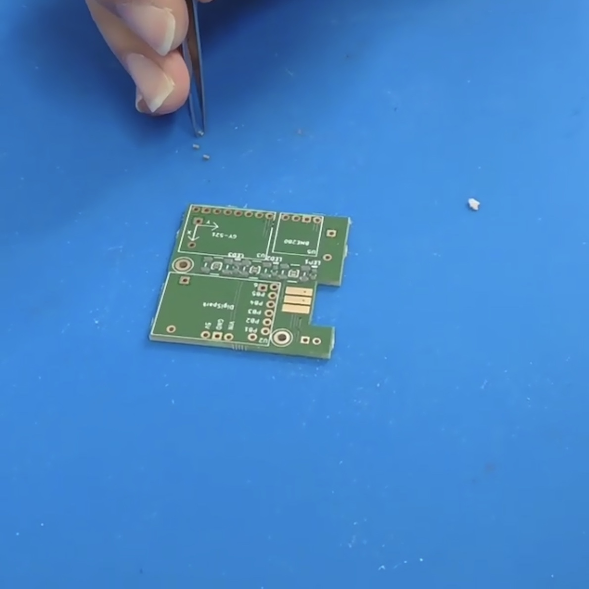</a>

#### Pins
After the LEDs and capacitors, you will need to solder the pins. 
**Important:** You need to know in advance if you want to build the LiPo version or not, otherwise you will not be able to add the respective pins for the DCDC booster and the LiPo charger module.

*Video:*

<a href="https://www.instagram.com/p/BltJqk9hLH9/?taken-by=pauls_3d_things">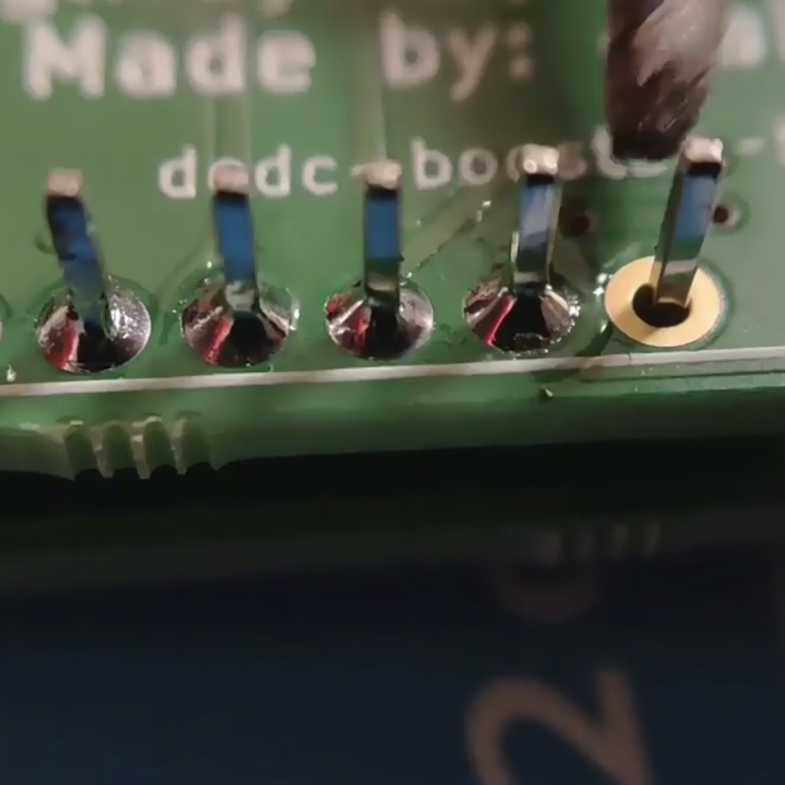</a>

#### Sensor + DigiSpark (USB Version)
The USB version only requires soldering the top parts

*Video:*

<a href="https://www.instagram.com/p/Bkhx7_AnTCE/?taken-by=pauls_3d_things">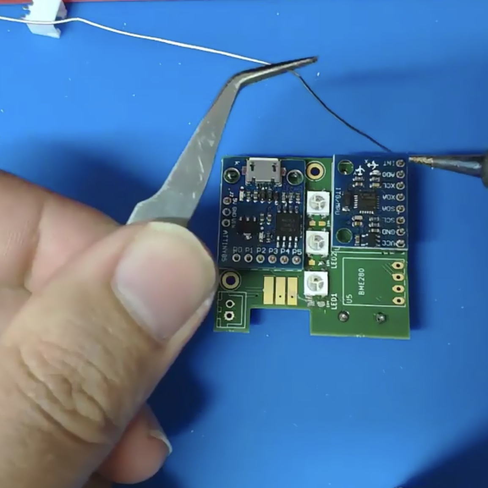</a>

#### DCDC Booster + LiPo Charger
Note, make sure you have the pins in place. Set the DCDC booster to 5V **before soldering** and **replace the PROG resistor** with a 10k resistor to make sure you only have small charging current of about 120mA.

*Video:*

#### Switch and Battery Connector
I think you will figure these out on your own. The square pin hole (PCB rev.8) is GND (black cable), the other 3.7V (red cable). Solder the connector facing to the bottom, i.e. not on the side of the LEDs.
The switch selects whether the LiPo charger is connected (=OFF or Charging) or the DCDC booster is conencted (=ON). **Never connect the USB while the huecube is on**. I have done it and nothing happened. But it is not designed to work this way.

### 3D Printing
TODO 😅

### Programming
TODO

## License

See the respective subfolders for their LICENSE.
